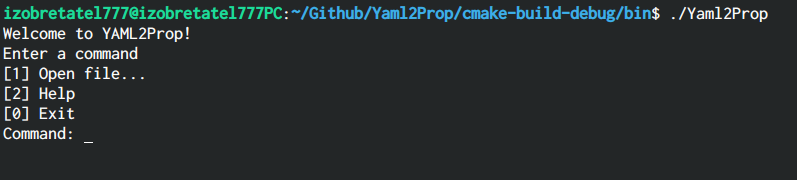
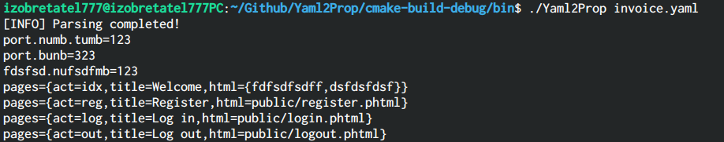
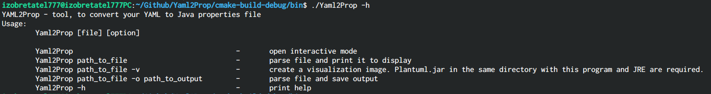

# Yaml2Prop

#### CLI tool designed to covert [YAML](https://yaml.org/) to (Java) [.properties](https://docs.oracle.com/cd/E23095_01/Platform.93/ATGProgGuide/html/s0204propertiesfileformat01.html).

Sometime, it is required to convert modern YAML formated files to old-style .properties that are still in use. This tool is written on pure C programming language with the usage of [libyaml](https://github.com/yaml/libyaml) library. Additionally it can visualize processed file using [PlantUML](https://github.com/plantuml/plantuml) library.

## Installation

Yaml2Prop is tiny and cross-platform utility. You can download binaries from [here](https://github.com/IZOBRETATEL777/Yaml2Prop/releases) with choosing appropriate build for your OS. Otherwise, you can compile it your own.

## Build

Before do everything, please download **CMake** 3.11 or higher and any **C complier** (GCC, MinGW, Clang and so on).

Also, you are required to download sources with all submodules using git or alike utility

#### Linux/macOS

`cmake . -DCMAKE_BUILD_TYPE=Release`

`cmake --build . --config Release`

Ready executable will be in bin/ folder

#### Windows

If you are using Visual Studio you can build like this:

`cmake . -A x64`

`cmake --build . --config Release`

Ready executable will be in bin/Release folder

## Usage

Two modes are available. The first one is interactive:

Also, it is possible to use the tool with parameters:

For visualization be shure that jar or your PlantumUML is located in the same directory with executable as well as file that is to be presented. Latest version of PlantumUML can be downloaded [here](https://github.com/plantuml/plantuml/releases/latest/).

All possible options listed in help page (parameter -h):

## Credits

Due to the lack of documentation for libyaml, the only source that could be used as a manual was [old blog post](https://www.wpsoftware.net/andrew/pages/libyaml.html) created in 2011. Fortunately, for PlantUML there is [comprehensive documentation](http://plantuml.com/en/guide).
